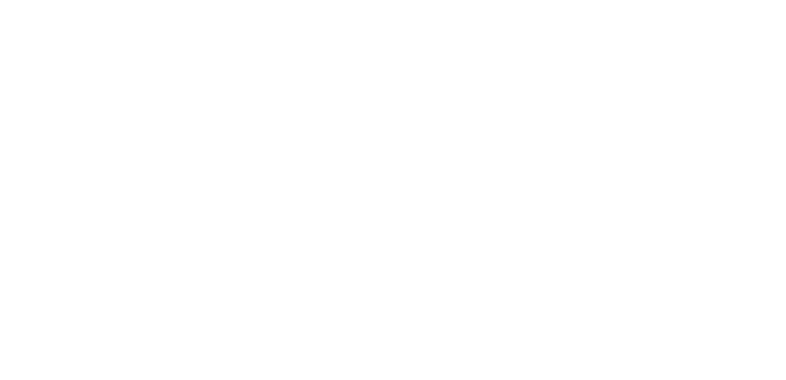

  

# IEEEXtreme 16.0 Solutions

Welcome to the IEEEXtreme 16.0 Solutions Repository! This repository contains my solutions to problems from the IEEEXtreme 16.0 programming competition. Each folder corresponds to a specific problem and includes both the problem statement (PDF) and my solution.

## Problems Solved

1. [ASCII Dancer](./ASCII%20Dancer)
2. [Gaius Letters](./Gaius%20Letters)
3. [My Treat](./My%20Treat)
4. [Pizza Cutter](./Pizza%20Cutter)
5. [Scheduler Redux](./Scheduler%20Redux)
6. [Scheduler](./Scheduler)
7. [What Language Am I Speaking](./What%20Language%20Am%20I%20Speaking)

## Repository Structure

Each problem folder typically contains:
- A PDF file with the problem statement
- Solution file

## Disclaimer

These solutions are my own work and were created for educational purposes. They may not be the most optimal solutions, but they passed the competition's test cases.

## Contributing

We welcome contributions to enhance this collection of IEEEXtreme 17.0 solutions:

- **Add New Solutions**: Submit solutions for problems not yet covered.
- **Improve Existing Solutions**: Optimize or clarify current solutions.
- **Multiple Language Implementations**: Add solutions in other programming languages.
- **Improve Documentation**: Enhance the README, code comments, or other documentation.

## License

This project is open source and available under the [MIT License](LICENSE).

<h3 align="center">Connect with me:</h3>

  
  
  
  
  

